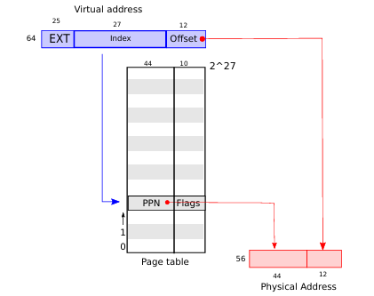
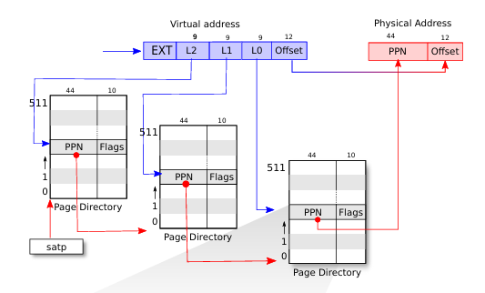
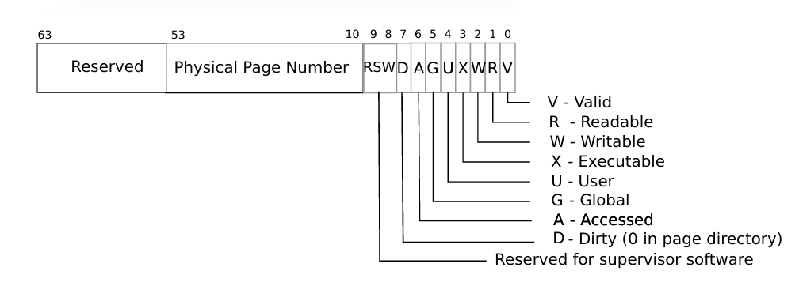
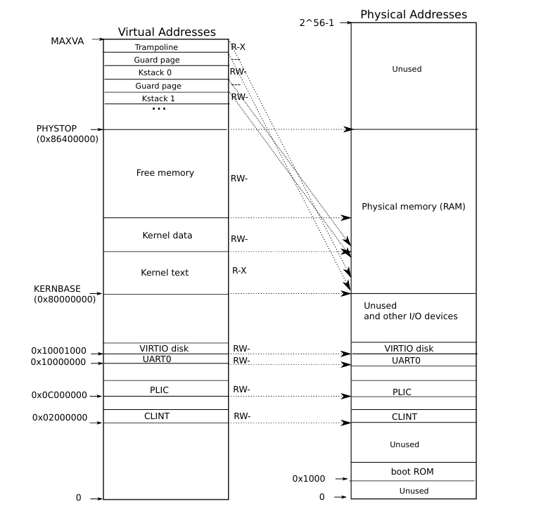

# xv6-riscv Memory Management Reference

This note is organized as a technical reference for memory management in `xv6-riscv` on RISC-V Sv39. It distinguishes between:

- Real xv6 mechanisms present in the kernel design.
- Branch-specific modifications in this repository.
- Custom extensions that simulate policy rather than implementing full demand-paging or swapping.

## Table of Contents

- [Overview of xv6 Memory System](#overview-of-xv6-memory-system)
- [Memory Layout in xv6-riscv](#memory-layout-in-xv6-riscv)
- [Page Tables and Address Translation](#page-tables-and-address-translation)
- [Memory Allocation: `kalloc`, `uvmalloc`, `sbrk`](#memory-allocation-kalloc-uvmalloc-sbrk)
- [`exec` and Memory Initialization](#exec-and-memory-initialization)
- [Memory Safety: `copyin`, `copyout`, `walkaddr`](#memory-safety-copyin-copyout-walkaddr)
- [Custom Extension: Memory Tracking](#custom-extension-memory-tracking)
- [Custom Extension: Page Replacement Simulation](#custom-extension-page-replacement-simulation)
- [File and Function Map](#file-and-function-map)
- [Build and Related Notes](#build-and-related-notes)

Repository source of truth:

- [`kernel/vm.c`](https://github.com/ob22a/xv6-riscv/blob/riscv/kernel/vm.c)
- [`kernel/kalloc.c`](https://github.com/ob22a/xv6-riscv/blob/riscv/kernel/kalloc.c)
- [`kernel/exec.c`](https://github.com/ob22a/xv6-riscv/blob/riscv/kernel/exec.c)
- [`kernel/proc.c`](https://github.com/ob22a/xv6-riscv/blob/riscv/kernel/proc.c)
- [`kernel/sysproc.c`](https://github.com/ob22a/xv6-riscv/blob/riscv/kernel/sysproc.c)
- [`kernel/trap.c`](https://github.com/ob22a/xv6-riscv/blob/riscv/kernel/trap.c)
- [`kernel/memlayout.h`](https://github.com/ob22a/xv6-riscv/blob/riscv/kernel/memlayout.h)
- [`kernel/riscv.h`](https://github.com/ob22a/xv6-riscv/blob/riscv/kernel/riscv.h)

## Overview of xv6 Memory System

### Execution environment

- **RISC-V** is the ISA targeted by this xv6 version. This note is specifically about the Sv39-based `xv6-riscv` codebase, not x86 xv6.
- **QEMU** emulates a RISC-V machine, so xv6 can run without physical RISC-V hardware.
- The kernel is compiled for RISC-V and runs inside QEMU, which emulates the CPU, devices, and physical memory layout expected by xv6.

### Core memory model

- xv6 uses **paging** with **4 KiB pages**.
- Address translation uses **Sv39**, which means a virtual address is interpreted through a **three-level page table**.
- Each process has its own **root page table**.
- The currently active page table is selected through the RISC-V **`satp`** register.

Code mapping:

- `kernel/riscv.h` -> `SATP_SV39`, `MAKE_SATP()`, `w_satp()`, `r_satp()`, `sfence_vma()`
- `kernel/vm.c` -> `walk()`, `mappages()`, `walkaddr()`
- `kernel/proc.c` -> `proc_pagetable()`, `growproc()`, `kfork()`

### Why multilevel page tables are used

If xv6 used a single large linear page table for the full Sv39 leaf space, the table would be unnecessarily large for small address spaces. Sv39 instead uses a tree:

```text
virtual address
   |
   +--> level-2 index (9 bits)
   +--> level-1 index (9 bits)
   +--> level-0 index (9 bits)
   +--> page offset   (12 bits)
```

This gives:

- 9 bits per level -> 512 entries per page-table page
- 12-bit offset -> `2^12 = 4096` bytes per page

`kernel/vm.c -> walk()` directly documents the Sv39 split:

- bits `30..38` -> level-2 index
- bits `21..29` -> level-1 index
- bits `12..20` -> level-0 index
- bits `0..11` -> byte offset

### SATP and TLB behavior

- `satp` holds the active address-translation configuration, including the root page table.
- When xv6 switches to a page table, it must also flush stale TLB entries.
- xv6 uses `sfence_vma()` for that flush.

Code mapping:

- `kernel/vm.c` -> `kvminithart()` calls `sfence_vma()`, `w_satp(MAKE_SATP(kernel_pagetable))`, then `sfence_vma()`
- `kernel/riscv.h` -> `w_satp()`, `sfence_vma()`

### PTE flags

The page table entry flags are defined in `kernel/riscv.h`:

```c
#define PTE_V (1L << 0) // valid
#define PTE_R (1L << 1)
#define PTE_W (1L << 2)
#define PTE_X (1L << 3)
#define PTE_U (1L << 4) // user can access
```

Important point:

- If `PTE_U` is not set, the mapping is not usable from user mode.

### Supporting diagrams





## Memory Layout in xv6-riscv

### Physical memory and device layout

The physical memory and MMIO layout used by xv6 under QEMU is defined in `kernel/memlayout.h`:

- `UART0` at `0x10000000`
- `VIRTIO0` at `0x10001000`
- `PLIC` at `0x0c000000`
- `KERNBASE` at `0x80000000`
- `PHYSTOP` at `KERNBASE + 128*1024*1024`

This means xv6 expects usable RAM starting at `0x80000000`, with the kernel loaded there by QEMU.

### Correct RISC-V virtual layout

This is **not** the old x86-style 32-bit split at `KERNBASE`. In `xv6-riscv`, user page tables and the kernel page table are distinct, and the user layout is constrained by Sv39 plus xv6's `MAXVA` convention.

Key definitions:

- `kernel/riscv.h` -> `MAXVA`
- `kernel/memlayout.h` -> `TRAMPOLINE`, `TRAPFRAME`, `KSTACK()`

Relevant facts:

- `MAXVA` is defined as one bit less than the theoretical Sv39 maximum to avoid sign-extension issues.
- `TRAMPOLINE` is mapped at `MAXVA - PGSIZE`.
- `TRAPFRAME` is at `TRAMPOLINE - PGSIZE`.
- Each process gets a kernel stack mapped high in the kernel page table via `KSTACK(p)`.

### User address-space structure

The user memory layout described by the combination of `kernel/memlayout.h` and the current `kernel/exec.c` implementation is:

```text
low addresses
  text
  data
  bss
  initial program image end
  guard page created by `exec()`
  user stack page(s)
  later growth via `sbrk()` / `growproc()` extends `p->sz` upward from the current end
  ...
  TRAPFRAME
  TRAMPOLINE
high addresses
```

Notes:

- `exec()` loads program segments at the ELF virtual addresses.
- `exec()` allocates `(USERSTACK + 1)` pages above the loaded program image, marks the lowest of those pages inaccessible with `uvmclear()`, and uses the remaining page(s) as the initial user stack.
- `TRAPFRAME` and `TRAMPOLINE` are special high virtual addresses used during trap entry and return.
- In this branch, positive `sbrk()` growth extends from the current `p->sz`; because `p->sz` already includes the stack allocation performed by `exec()`, the exact growth semantics should be understood from `kernel/exec.c`, `kernel/proc.c -> growproc()`, and `kernel/sysproc.c -> sys_sbrk()` rather than from a generic textbook layout diagram.

### Kernel mapping strategy

`kernel/vm.c -> kvmmake()` constructs the kernel page table. It:

- Allocates the root page-table page with `kalloc()`.
- Maps device MMIO regions with `kvmmap()`.
- Maps kernel text as read-execute.
- Maps kernel data and usable physical RAM as read-write.
- Maps the trampoline page.
- Maps one kernel stack per process using `proc_mapstacks()`.

This is effectively a **direct map** for most kernel-managed physical memory: many kernel virtual addresses equal their physical addresses in the `KERNBASE..PHYSTOP` region.



## Page Tables and Address Translation

### Root page tables

The central type is `pagetable_t`, defined in `kernel/riscv.h` as `uint64 *`, meaning a pointer to a page-table page containing 512 PTEs.

There are two major cases:

- `kernel_pagetable` in `kernel/vm.c`
- One user page table per process in `kernel/proc.c`

Code mapping:

- `kernel/vm.c` -> `pagetable_t kernel_pagetable`, `kvmmake()`, `uvmcreate()`
- `kernel/proc.c` -> `proc_pagetable()`, `proc_freepagetable()`

### Walking the page-table tree

`kernel/vm.c -> walk(pagetable, va, alloc)`:

- Traverses the level-2, level-1, and level-0 page-table hierarchy.
- If `alloc != 0`, it allocates missing intermediate page-table pages using `kalloc()`.
- Returns a pointer to the leaf PTE corresponding to `va`.

This is the fundamental helper used by higher-level routines such as `mappages()`, `walkaddr()`, `uvmunmap()`, and allocation/freeing logic.

### Translating a user virtual address

`kernel/vm.c -> walkaddr(pagetable, va)`:

- Returns the physical page base address corresponding to a user virtual address.
- Rejects addresses `>= MAXVA`.
- Returns `0` if:
  - the PTE does not exist,
  - the PTE is invalid,
  - or `PTE_U` is not set.

Callers add the page offset separately, so `walkaddr()` is a translation helper for the containing page, not a complete `va -> pa` byte-address computation by itself.

This function is used whenever the kernel needs to safely dereference user memory by first validating the mapping.

### Creating mappings

`kernel/vm.c -> mappages(pagetable, va, size, pa, perm)`:

- Requires page-aligned `va` and `size`.
- Uses `walk()` to locate or create the leaf PTEs.
- Panics on remapping an already valid PTE.
- Writes `PA2PTE(pa) | perm | PTE_V` into the PTE.

This is the main mapping primitive in xv6.

### Freeing mappings and page tables

Key functions:

- `kernel/vm.c` -> `uvmunmap()` removes mappings and optionally frees physical pages.
- `kernel/vm.c` -> `freewalk()` recursively frees lower-level page-table pages.
- `kernel/vm.c` -> `uvmfree()` first unmaps user pages, then frees page-table pages.

Important distinction:

- `uvmunmap()` deals with **leaf mappings**.
- `freewalk()` deals with **page-table structure pages**.

## Memory Allocation: `kalloc`, `uvmalloc`, `sbrk`

### Allocation layers

Memory allocation in xv6 is layered:

```text
user program
   |
   v
user library / system call interface
   |
   v
sys_sbrk() / growproc()
   |
   v
uvmalloc() / uvmdealloc()
   |
   v
mappages() / walk()
   |
   v
kalloc()
   |
   v
physical page from RAM
```

The layers have different responsibilities:

- `kalloc()` manages raw physical pages.
- `uvmalloc()` connects physical pages to a process page table.
- `sys_sbrk()` or `growproc()` changes the process-visible size.

### Physical page allocator

Code mapping:

- `kernel/kalloc.c` -> `kinit()`, `freerange()`, `kalloc()`, `kfree()`

Free pages are linked through `struct run`:

```text
[page A] -> [page B] -> [page C] -> NULL
```

The global allocator state is:

```c
struct {
  struct spinlock lock;
  struct run *freelist;
} kmem;
```

How `kalloc()` works:

```c
void *
kalloc(void)
{
  struct run *r;

  acquire(&kmem.lock);
  r = kmem.freelist;
  if(r)
    kmem.freelist = r->next;
  release(&kmem.lock);

  if(r)
    memset((char*)r, 5, PGSIZE); // fill with junk
  return (void*)r;
}
```

How `kfree()` works:

```c
void
kfree(void *pa)
{
  struct run *r;

  if(((uint64)pa % PGSIZE) != 0 || (char*)pa < end || (uint64)pa >= PHYSTOP)
    panic("kfree");

  // Fill with junk to catch dangling refs.
  memset(pa, 1, PGSIZE);

  r = (struct run*)pa;

  acquire(&kmem.lock);
  r->next = kmem.freelist;
  kmem.freelist = r;
  release(&kmem.lock);
}
```

Important detail:

- The junk fill in `kalloc()` and `kfree()` is a debugging aid that helps expose use-after-free and uninitialized-memory issues.

### User page-table allocation

Code mapping:

- `kernel/vm.c` -> `uvmcreate()`, `uvmalloc()`, `uvmdealloc()`, `uvmunmap()`
- `kernel/proc.c` -> `growproc()`

`uvmcreate()`:

- Allocates one zeroed page-table page and returns it as a new empty user root page table.

`uvmalloc()`:

- Grows a process from `oldsz` to `newsz`.
- Rounds `oldsz` upward to a page boundary.
- Allocates one physical page at a time with `kalloc()`.
- Zero-fills the new page.
- Installs the mapping using `mappages()`.
- Applies permissions `PTE_R | PTE_U | xperm`.

`uvmdealloc()`:

- Shrinks memory from `oldsz` to `newsz`.
- Computes how many pages must be removed.
- Calls `uvmunmap()` with `do_free = 1`.

### `sbrk()` and process growth

Code mapping:

- `kernel/sysproc.c` -> `sys_sbrk()`
- `kernel/proc.c` -> `growproc()`

In this branch, `sys_sbrk()` supports more than one behavior:

- If `t == SBRK_EAGER` or `n < 0`, it uses `growproc(n)`.
- Otherwise, it increases `myproc()->sz` without allocating physical memory immediately.

This means the branch supports a **lazy allocation path** in addition to eager growth.

### Lazy allocation path in this branch

Code mapping:

- `kernel/sysproc.c` -> `sys_sbrk()`
- `kernel/trap.c` -> `usertrap()`
- `kernel/vm.c` -> `vmfault()`, `ismapped()`

Behavior:

1. `sys_sbrk()` may increase `p->sz` without calling `growproc()`.
2. If the process later touches an unmapped page in that range, a page fault occurs.
3. `kernel/trap.c -> usertrap()` checks for load/store page faults via `r_scause() == 13` or `15`.
4. `usertrap()` calls `vmfault(p->pagetable, r_stval(), ...)`.
5. `vmfault()` validates the address against `p->sz`, rounds it down with `PGROUNDDOWN()`, rejects already mapped pages via `ismapped()`, allocates a page, zeroes it, and maps it with `PTE_W | PTE_U | PTE_R`.

Important distinction:

- This is a **custom extension in this repository**, not the minimal eager-only xv6 behavior usually presented in the standard MIT text.

## `exec` and Memory Initialization

### Purpose of `exec`

`exec` replaces the current process's user memory image with a new program. The process itself is not destroyed:

- PID remains the same.
- Open-process identity remains the same.
- User memory is rebuilt from the ELF image.

Code mapping:

- `kernel/exec.c` -> `kexec()`, `loadseg()`, `flags2perm()`

### High-level flow

`kernel/exec.c -> kexec()` performs these steps:

1. Open the executable file.
2. Read and validate the ELF header.
3. Create a fresh process page table with `proc_pagetable()`.
4. Read each loadable ELF program header.
5. Allocate virtual memory for each segment with `uvmalloc()`.
6. Load file-backed bytes with `loadseg()`.
7. Allocate stack pages.
8. Mark one page below the stack inaccessible as a guard page with `uvmclear()`.
9. Copy argument strings and the `argv` pointer array onto the new stack.
10. Commit the new page table and free the old one.

### ELF loading details

Key checks in `kexec()`:

- `elf.magic == ELF_MAGIC`
- `ph.memsz >= ph.filesz`
- `ph.vaddr + ph.memsz` does not overflow
- `ph.vaddr` is page aligned

`kernel/exec.c -> flags2perm()` maps ELF flags to page permissions:

- executable -> `PTE_X`
- writable -> `PTE_W`

### `filesz` versus `memsz`

This distinction matters during program loading:

- `filesz` = bytes actually stored in the executable file
- `memsz` = bytes the segment must occupy in memory

If `memsz > filesz`, the remaining bytes represent zero-initialized memory, such as `.bss`.

Example:

- `filesz = 2112`
- `memsz = 2136`
- the final 24 bytes are zero-filled in memory

How this is implemented:

- `uvmalloc()` allocates and zeroes the necessary pages up to `memsz`
- `loadseg()` copies only the `filesz` bytes from disk into the already mapped memory

### Stack setup and guard page

After loading segments, `kexec()`:

- rounds `sz` upward with `PGROUNDUP(sz)`
- allocates `(USERSTACK + 1)` pages
- marks the first of those pages inaccessible using `uvmclear()`
- uses the remaining pages as the user stack

This inaccessible page acts as a **guard page** that catches stack overflow into the page below.

### Final commit

At the end of `kexec()`:

- `p->pagetable` is replaced with the new page table
- `p->sz` becomes the new size
- `p->trapframe->epc` is set to the ELF entry point
- `p->trapframe->sp` is set to the initial user stack pointer
- the old page table is freed via `proc_freepagetable()`

## Memory Safety: `copyin`, `copyout`, `walkaddr`

### Why these helpers exist

The kernel must not blindly dereference user virtual addresses:

- the address may be unmapped,
- it may point outside user memory,
- or it may lack the required permissions.

Instead, xv6 uses controlled copy helpers.

Code mapping:

- `kernel/vm.c` -> `walkaddr()`, `copyin()`, `copyout()`, `copyinstr()`

### `walkaddr()`

`walkaddr()` is the basic validation and translation helper for user addresses:

- validates `va < MAXVA`
- locates the PTE through `walk()`
- requires `PTE_V`
- requires `PTE_U`
- returns the physical address base of the mapped page

If any condition fails, it returns `0`.

### `copyin()`

`copyin(pagetable, dst, srcva, len)`:

- copies from user virtual memory into a kernel buffer
- walks page by page
- handles page boundaries correctly
- in this branch, if `walkaddr()` returns `0`, it may invoke `vmfault()` to realize a lazily allocated page

### `copyout()`

`copyout(pagetable, dstva, src, len)`:

- copies from a kernel buffer into user virtual memory
- validates the destination mapping
- explicitly rejects copying into a user page that lacks `PTE_W`
- in this branch, it may also trigger `vmfault()` if the page is part of the lazily allocated range

### `copyinstr()`

`copyinstr(pagetable, dst, srcva, max)`:

- copies a null-terminated string from user memory to the kernel
- stops at `'\0'` or `max`
- returns `-1` if the mapping is invalid or no terminating null is found in range
- unlike `copyin()` and `copyout()` in this branch, it does not call `vmfault()`, so it relies on `walkaddr()` succeeding directly

### Safety insight

These routines are part of xv6's protection boundary:

- user code does not directly expose raw pointers as trusted kernel addresses
- the kernel validates each page through the process page table
- permissions such as `PTE_U` and `PTE_W` are enforced during the copy path

## Custom Extension: Memory Tracking

This section describes branch-specific tracking logic added on top of xv6. It is not part of stock xv6.

### Purpose

The extension counts resident user pages (pages that currently have physical backing) per process and exposes the count through a system call.

Code mapping:

- `kernel/proc.h` -> `struct proc { int pages_used; }`
- `kernel/proc.c` -> `allocproc()`, `freeproc()`, `kfork()`
- `kernel/vm.c` -> `uvmalloc()`, `uvmdealloc()`, `vmfault()`
- `kernel/sysproc.c` -> `sys_getmemusage()`
- `kernel/syscall.c` -> syscall dispatch entry
- `kernel/syscall.h` -> `SYS_getmemusage`
- `user/usys.pl` -> `entry("getmemusage")`
- `user/user.h` -> `int getmemusage(void);`

### Where the per-process state lives

The counter is stored in `struct proc` as `pages_used`.

Initialization and lifecycle:

- `kernel/proc.c -> allocproc()` sets `p->pages_used = 0`
- `kernel/proc.c -> freeproc()` resets `p->pages_used = 0`
- `kernel/proc.c -> kfork()` copies `np->pages_used = p->pages_used`
- `kernel/exec.c -> kexec()` resets `p->pages_used = 0`

That last reset is a design choice in this branch: it excludes the pages used to load the freshly executed program from the reported post-`exec` count.

### Allocation-side accounting

The implementation logic is:

- `kernel/vm.c -> uvmalloc()` increments `myproc()->pages_used` when it allocates and maps a user page
- `kernel/vm.c -> vmfault()` increments `myproc()->pages_used` when lazy allocation materializes a page on first access
- `kernel/vm.c -> uvmdealloc()` decrements `myproc()->pages_used` by the number of unmapped pages

Deallocation-side accounting:

```c
int pages_removed = (PGROUNDUP(oldsz) - PGROUNDUP(newsz)) / PGSIZE; // Always decimal due to PGROUNDUP AND PGROUNDDOWN

myproc()->pages_used -= pages_removed;
```

### System call interface

The custom system call returns the per-process page count:

```c
// Custom system call to track memory usage
uint64 sys_getmemusage(void) {
  return myproc()->pages_used;
}
```

To expose a new syscall in xv6, the complete path is:

- implement the kernel function in `kernel/sysproc.c`
- declare it in `kernel/syscall.c`
- assign a syscall number in `kernel/syscall.h`
- add it to the syscall dispatch table in `kernel/syscall.c`
- add a wrapper entry in `user/usys.pl`
- add the user declaration in `user/user.h`

Generated syscall wrappers follow the RISC-V convention of placing the syscall number in `a7` and issuing `ecall`:

```s
# generated by usys.pl - do not edit
#include "kernel/syscall.h"
.global fork
fork:
 li a7, SYS_fork
 ecall
 ret
```

If adding a new syscall, the dispatch table pattern looks like:

```c
extern uint64 sys_fork(void); // extern indicate that this function really exists but it is somewhere else so don't cause error if it is called here

//Then go to syscall.h to define the new sys call and add number for it

// After that add it in the array mapping using the name in syscall.h and that is basically a unique number which will map to the function placed next to it
static uint64 (*syscalls[])(void) = {
[SYS_fork]    sys_fork,
[SYS_exit]    sys_exit,
...
};
```

### Test program

The custom user-space test exercises growth, shrink, and fork behavior:

```c
#include "kernel/types.h"
#include "user/user.h"

int main()
{
  printf("Pages used at the start: %d\n", getmemusage());
  sbrk(4096); // Request 4096 byte of memory which is one page
  printf("Page used after 1 page addition: %d\n",getmemusage());
  sbrk(4096); // Request 4096 byte of memory which is one page
  printf("Page used after 2 pages addition: %d\n",getmemusage());

  sbrk(-4096); // shrinking by a page
  printf("Page used after shrinking 1 page: %d\n",getmemusage());

  // Test while forking 
  int pid=fork();
  if(pid==0){
   printf("child: %d\n", getmemusage());
   exit(0);
  } 
  else {
    wait(0);
    printf("parent: %d\n", getmemusage());
  }
  exit(0);
}
```

Observed output example:

```text
Pages used at the start: 0
Page used after 1 page addition: 1
Page used after 2 pages addition: 2
Page used after shrinking 1 page: 1
child: 1
parent: 1
```

`getmemtest` now also checks the lazy-allocation path:

- after `sbrklazy(4096)`, count should not increase yet
- after touching the lazy page, `vmfault()` allocates it and count increases

## Custom Extension: Page Replacement Simulation

This section is a **simulation**, not real xv6 swapping or real page replacement.

### What it does and does not do

This implementation tracks allocation order and reports which page would be evicted under FIFO. It does **not**:

- write evicted pages to disk,
- invalidate process mappings in a fully coherent way,
- reload pages on demand,
- or implement a complete virtual-memory replacement policy.

It is therefore best described as a **page-replacement simulation** attached to allocation events.

### Data structures

The custom state is placed in `kernel/vm.c`:

```c
#define MAX_TRACKED_PAGES 50

struct fifo_node {
  int pid;
  uint64 va;
  uint64 seq;
  struct fifo_node *prev;
  struct fifo_node *next;
  struct fifo_node *free_next;
};
```

Important clarification:

- This queue state is **not** the hardware page table used by Sv39 translation.
- It is custom metadata used by the FIFO simulation.

### FIFO policy logic

The FIFO victim-selection operation is:

```c
static void
fifo_evict_oldest_locked(void)
{
  struct fifo_node *victim = fifo_state.head;
  if(victim == 0)
    return;
  printf("EVICT: pid %d va %p seq %d\n", victim->pid, (void*)victim->va, (int)victim->seq);
  fifo_remove_node(victim);
}
```

Interpretation:

- `seq` records insertion order.
- FIFO victim is always the queue head.
- Eviction updates simulation metadata and prints the victim to console.

### Where tracking is attached

Tracking hooks are inside `kernel/vm.c -> uvmalloc()` and `kernel/vm.c -> vmfault()`. For each newly materialized user page, the branch enqueues:

```text
fifo_track_page(p->pid, a);
```

Cleanup hooks:

- `uvmdealloc()` removes FIFO entries in unmapped ranges via `fifo_remove_range(...)`
- `freeproc()` removes all entries for a terminated process via `fifo_remove_pid(pid)`
- when no free node is available, FIFO evicts the head in O(1)

### Conceptual limitation

Real page replacement in an operating system requires at least:

- deciding which mapped page to evict,
- updating the owning process page table,
- preserving page contents somewhere such as swap,
- recognizing future page faults on the evicted page,
- and restoring the page on demand.

This branch does not attempt that full mechanism. It only simulates the decision and logs the victim.

## File and Function Map

### Core xv6 memory files

- [`kernel/kalloc.c`](https://github.com/ob22a/xv6-riscv/blob/riscv/kernel/kalloc.c) -> `kinit()`, `freerange()`, `kalloc()`, `kfree()`
- [`kernel/vm.c`](https://github.com/ob22a/xv6-riscv/blob/riscv/kernel/vm.c) -> `kvmmake()`, `kvmmap()`, `kvminit()`, `kvminithart()`, `walk()`, `walkaddr()`, `mappages()`, `uvmcreate()`, `uvmunmap()`, `uvmalloc()`, `uvmdealloc()`, `freewalk()`, `uvmfree()`, `uvmcopy()`, `uvmclear()`, `copyin()`, `copyout()`, `copyinstr()`
- [`kernel/exec.c`](https://github.com/ob22a/xv6-riscv/blob/riscv/kernel/exec.c) -> `kexec()`, `loadseg()`, `flags2perm()`
- [`kernel/proc.c`](https://github.com/ob22a/xv6-riscv/blob/riscv/kernel/proc.c) -> `proc_mapstacks()`, `proc_pagetable()`, `proc_freepagetable()`, `growproc()`, `kfork()`
- [`kernel/trap.c`](https://github.com/ob22a/xv6-riscv/blob/riscv/kernel/trap.c) -> `usertrap()`, `prepare_return()`, `kerneltrap()`
- [`kernel/memlayout.h`](https://github.com/ob22a/xv6-riscv/blob/riscv/kernel/memlayout.h) -> hardware memory layout, `KERNBASE`, `PHYSTOP`, `TRAMPOLINE`, `TRAPFRAME`, `KSTACK()`
- [`kernel/riscv.h`](https://github.com/ob22a/xv6-riscv/blob/riscv/kernel/riscv.h) -> Sv39 helpers, PTE flags, `MAKE_SATP()`, `sfence_vma()`, `MAXVA`

### Custom-extension files in this branch

- [`kernel/vm.c`](https://github.com/ob22a/xv6-riscv/blob/riscv/kernel/vm.c) -> FIFO queue simulation (`fifo_track_page()`, `fifo_remove_range()`, `fifo_remove_pid()`), `vmfault()`, `ismapped()`, tracking additions in `uvmalloc()` and `uvmdealloc()`
- [`kernel/proc.h`](https://github.com/ob22a/xv6-riscv/blob/riscv/kernel/proc.h) -> `pages_used`
- [`kernel/proc.c`](https://github.com/ob22a/xv6-riscv/blob/riscv/kernel/proc.c) -> initialization/copy/reset of `pages_used`
- [`kernel/exec.c`](https://github.com/ob22a/xv6-riscv/blob/riscv/kernel/exec.c) -> reset of `pages_used` after successful `exec`
- [`kernel/sysproc.c`](https://github.com/ob22a/xv6-riscv/blob/riscv/kernel/sysproc.c) -> `sys_getmemusage()`, extended `sys_sbrk()`
- [`kernel/syscall.c`](https://github.com/ob22a/xv6-riscv/blob/riscv/kernel/syscall.c) / [`kernel/syscall.h`](https://github.com/ob22a/xv6-riscv/blob/riscv/kernel/syscall.h) -> syscall registration (`getmemusage`)
- [`user/usys.pl`](https://github.com/ob22a/xv6-riscv/blob/riscv/user/usys.pl) / [`user/user.h`](https://github.com/ob22a/xv6-riscv/blob/riscv/user/user.h) -> user wrapper exposure
- [`user/getmemtest.c`](https://github.com/ob22a/xv6-riscv/blob/riscv/user/getmemtest.c) -> memtracker test including eager + lazy page allocation
- [`user/fifotest.c`](https://github.com/ob22a/xv6-riscv/blob/riscv/user/fifotest.c) -> test program for the FIFO page-replacement simulation

## Build and Related Notes

### Makefile role

The `Makefile` automates:

- compiling kernel object files,
- compiling user programs,
- linking the kernel,
- building the file-system image,
- and launching QEMU.

Operationally:

- `make qemu` builds the kernel and user programs, creates the disk image, and runs xv6 in QEMU.
- `make clean` removes generated build artifacts.

If a new user test program is added, it must be placed in `user/` and added to `UPROGS` in the `Makefile`.

### Other file types

- `.S` -> preprocessed assembly
- `.s` -> plain assembly
- `.o` -> object file consumed by the linker

These matter because xv6 includes low-level code paths, especially for trap entry/exit and boot/setup, that cannot be expressed purely in C.
